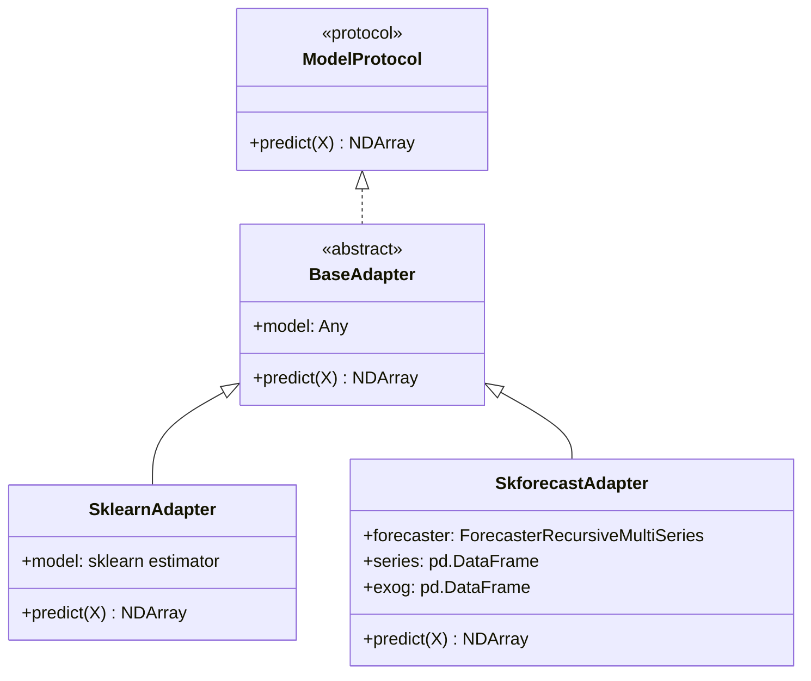
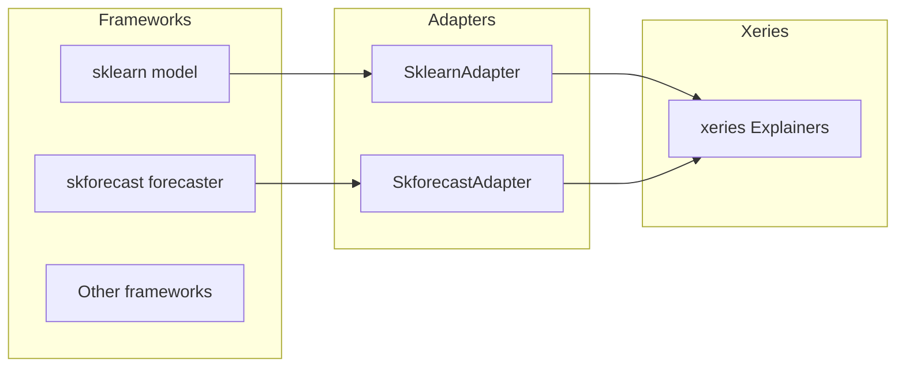
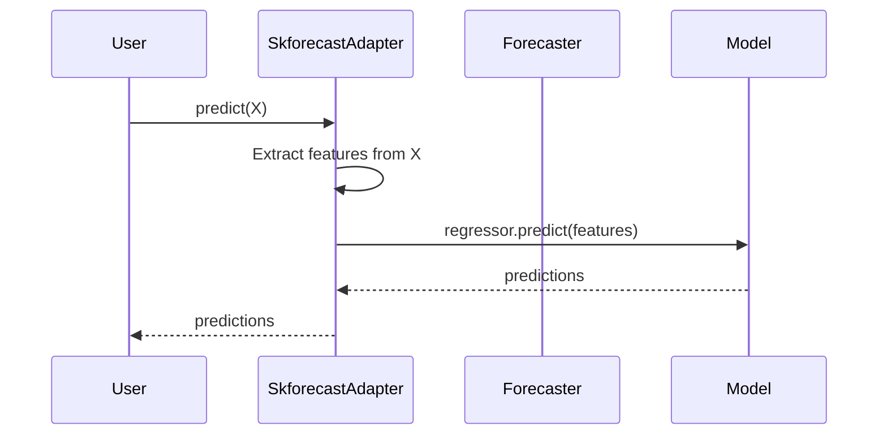
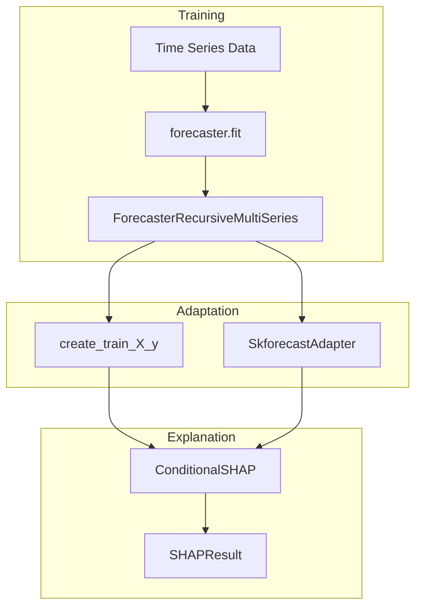

# Adapters Module

The adapters module provides wrappers that adapt different model frameworks to work with xeries explainers.

## Location

`xeries/adapters/`

## Architecture



## Purpose



## Components

### SklearnAdapter (`sklearn.py`)

Wraps scikit-learn compatible models.

```python
from xeries.adapters import SklearnAdapter
from sklearn.ensemble import RandomForestRegressor

model = RandomForestRegressor()
model.fit(X_train, y_train)

adapter = SklearnAdapter(model)

# Now use with explainer
from xeries import ConditionalSHAP
explainer = ConditionalSHAP(adapter, X_train, series_col='level')
```

**Note:** Most sklearn models already implement `predict()`, so the adapter is optional but provides a consistent interface.

---

### SkforecastAdapter (`skforecast.py`)

Wraps skforecast `ForecasterRecursiveMultiSeries` for use with xeries.



**Usage:**

```python
from xeries.adapters import SkforecastAdapter, from_skforecast
from skforecast.recursive import ForecasterRecursiveMultiSeries

# Train forecaster
forecaster = ForecasterRecursiveMultiSeries(
    regressor=LGBMRegressor(),
    lags=7,
    transformer_series=StandardScaler()
)
forecaster.fit(series=data)

# Create adapter
adapter = SkforecastAdapter(
    forecaster=forecaster,
    series=data,
    exog=exog_data  # Optional
)

# Or use convenience function
adapter = from_skforecast(forecaster, series=data)

# Use with explainer
from xeries import ConditionalPermutationImportance

explainer = ConditionalPermutationImportance(
    model=adapter,
    metric='mse'
)

# Get training data from forecaster
X_train, y_train = forecaster.create_train_X_y(series=data)

result = explainer.explain(X_train, y_train)
```

**Key Features:**
- Extracts the internal regressor for prediction
- Handles the skforecast feature matrix format
- Works with `series_col='level'` or `'_level_skforecast'`

---

## Convenience Function

### from_skforecast

Factory function to create a SkforecastAdapter.

```python
from xeries.adapters import from_skforecast

adapter = from_skforecast(
    forecaster,
    series=data,
    exog=exog_data
)
```

## Integration Example



**Full Example:**

```python
import pandas as pd
from lightgbm import LGBMRegressor
from skforecast.recursive import ForecasterRecursiveMultiSeries
from sklearn.preprocessing import StandardScaler

from xeries import ConditionalSHAP
from xeries.adapters import from_skforecast
from xeries.hierarchy import HierarchyDefinition, HierarchicalExplainer

# 1. Prepare data
series_data = pd.DataFrame(...)  # Multi-series data

# 2. Train forecaster
forecaster = ForecasterRecursiveMultiSeries(
    regressor=LGBMRegressor(n_estimators=100),
    lags=7,
    transformer_series=StandardScaler()
)
forecaster.fit(series=series_data)

# 3. Create adapter
adapter = from_skforecast(forecaster, series=series_data)

# 4. Get training data
X_train, y_train = forecaster.create_train_X_y(series=series_data)

# 5. Create explainer
explainer = ConditionalSHAP(
    model=adapter,
    background_data=X_train,
    series_col='level'
)

# 6. Compute explanations
result = explainer.explain(X_train)
print(result.mean_abs_shap())

# 7. With hierarchy
hierarchy = HierarchyDefinition(
    levels=['region', 'store'],
    columns=['region_id', 'store_id']
)
hier_explainer = HierarchicalExplainer(explainer, hierarchy)
hier_result = hier_explainer.explain(X_train, include_raw=True)
```

## Creating Custom Adapters

To create an adapter for another framework:

```python
from xeries.adapters import BaseAdapter
import pandas as pd
import numpy as np

class MyFrameworkAdapter(BaseAdapter):
    """Adapter for MyFramework models."""

    def __init__(self, model, **kwargs):
        super().__init__(model)
        self.kwargs = kwargs

    def predict(self, X: pd.DataFrame) -> np.ndarray:
        """Make predictions using the wrapped model."""
        # Transform X as needed by your framework
        features = self._prepare_features(X)
        
        # Call the model's prediction method
        predictions = self.model.my_predict_method(features)
        
        return np.asarray(predictions)

    def _prepare_features(self, X):
        # Framework-specific preprocessing
        ...
```
