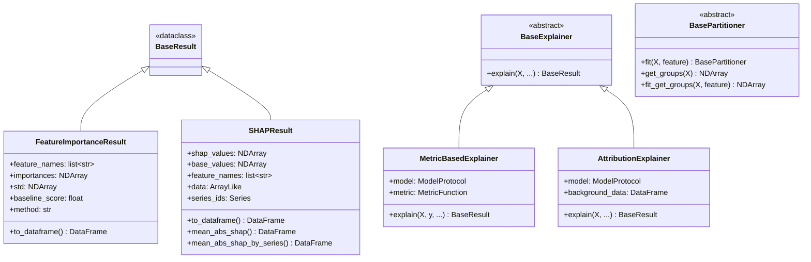

# Core Module

The core module provides the foundational classes and types used throughout xeries.

## Location

`xeries/core/`

## Class Hierarchy



## Components

### Base Classes (`base.py`)

#### BaseExplainer

Abstract base class for all feature explainers.

```python
from abc import ABC, abstractmethod

class BaseExplainer(ABC):
    """Abstract base class for all feature explainers."""

    @abstractmethod
    def explain(
        self,
        X: pd.DataFrame,
        *args: Any,
        **kwargs: Any,
    ) -> BaseResult:
        """Compute the explanation."""
        ...
```

#### MetricBasedExplainer

Base class for explainers that rely on predictive performance metrics (e.g., permutation importance).

```python
class MetricBasedExplainer(BaseExplainer):
    """Base class for metric-based explainers."""

    def __init__(
        self,
        model: ModelProtocol,
        metric: MetricFunction | str = "mse",
        random_state: int | None = None,
    ):
        ...
```

**Supported Metrics:**
- `'mse'` - Mean Squared Error
- `'mae'` - Mean Absolute Error
- `'rmse'` - Root Mean Squared Error
- `'r2'` - R-squared
- Custom callable: `(y_true, y_pred) -> float`

#### AttributionExplainer

Base class for attribution-based explainers (e.g., SHAP).

```python
class AttributionExplainer(BaseExplainer):
    """Base class for attribution explainers."""

    def __init__(
        self,
        model: ModelProtocol,
        background_data: pd.DataFrame,
        random_state: int | None = None,
    ):
        ...
```

#### BasePartitioner

Abstract base class for data partitioners.

```python
class BasePartitioner(ABC):
    """Abstract base class for data partitioners."""

    @abstractmethod
    def fit(self, X: pd.DataFrame, feature: str) -> BasePartitioner:
        """Fit the partitioner to the data."""
        ...

    @abstractmethod
    def get_groups(self, X: pd.DataFrame) -> NDArray[np.intp]:
        """Get group labels for each sample."""
        ...

    def fit_get_groups(self, X: pd.DataFrame, feature: str) -> NDArray[np.intp]:
        """Fit and return groups in one step."""
        ...
```

### Type Definitions (`types.py`)

#### ModelProtocol

Protocol defining the expected model interface.

```python
class ModelProtocol(Protocol):
    """Protocol for models that can be used with xeries explainers."""

    def predict(self, X: ArrayLike | pd.DataFrame) -> NDArray | pd.Series:
        """Make predictions on input data."""
        ...
```

#### FeatureImportanceResult

Container for permutation feature importance results.

```python
@dataclass
class FeatureImportanceResult(BaseResult):
    """Container for feature importance results."""

    feature_names: list[str]
    importances: NDArray[np.floating]
    std: NDArray[np.floating] | None = None
    baseline_score: float = 0.0
    permuted_scores: dict[str, list[float]] = field(default_factory=dict)
    method: str = "permutation"
    n_repeats: int = 1

    def to_dataframe(self) -> pd.DataFrame:
        """Convert results to a pandas DataFrame."""
        ...
```

#### SHAPResult

Container for SHAP explanation results.

```python
@dataclass
class SHAPResult(BaseResult):
    """Container for SHAP explanation results."""

    shap_values: NDArray[np.floating]      # Shape: (n_samples, n_features)
    base_values: NDArray[np.floating]       # Shape: (n_samples,)
    feature_names: list[str]
    data: ArrayLike
    series_ids: pd.Series | None = None    # For hierarchical aggregation

    def to_dataframe(self) -> pd.DataFrame:
        """Convert SHAP values to DataFrame."""
        ...

    def mean_abs_shap(self) -> pd.DataFrame:
        """Compute mean absolute SHAP values per feature."""
        ...

    def mean_abs_shap_by_series(self) -> pd.DataFrame:
        """Compute mean absolute SHAP values grouped by series."""
        ...
```

### Type Aliases

```python
ArrayLike = np.ndarray | pd.Series | pd.DataFrame
GroupLabels = np.ndarray | pd.Series | list[Any]
MetricFunction = Callable[[ArrayLike, ArrayLike], float | int]
```

## Usage Example

```python
from xeries.core.types import SHAPResult, FeatureImportanceResult
from xeries.core.base import BaseExplainer

# Results have consistent interfaces
shap_result: SHAPResult = explainer.explain(X)
shap_df = shap_result.to_dataframe()
importance = shap_result.mean_abs_shap()

pfi_result: FeatureImportanceResult = pfi_explainer.explain(X, y)
pfi_df = pfi_result.to_dataframe()
```
