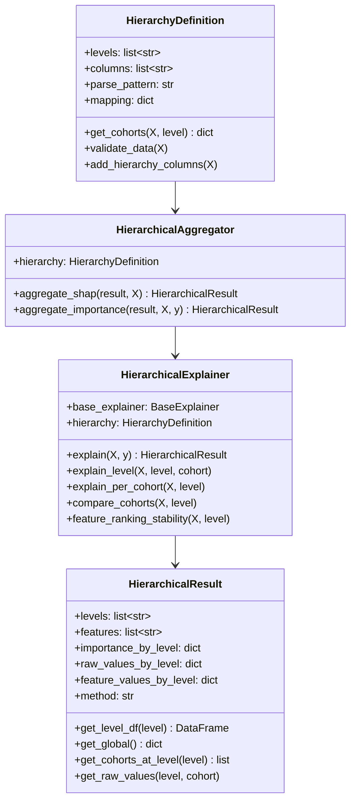
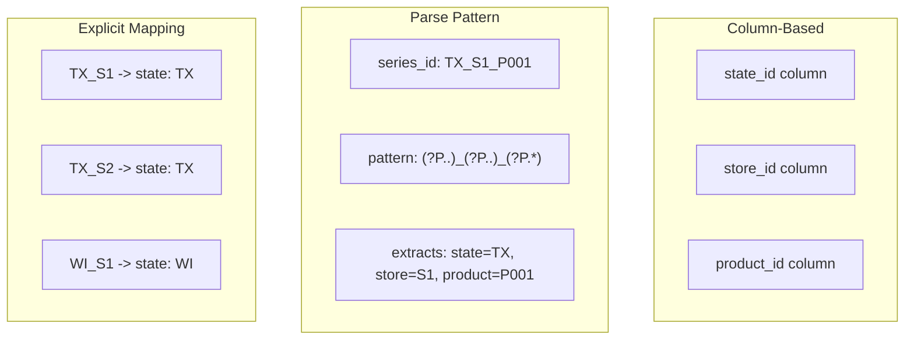
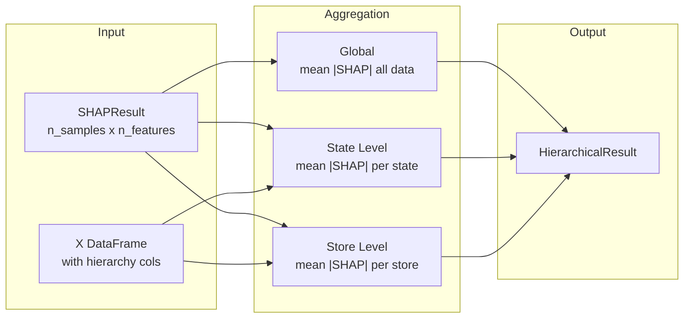
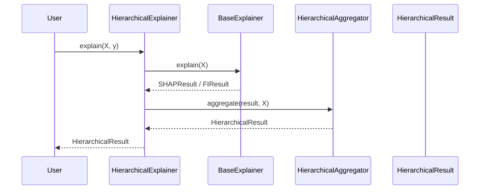
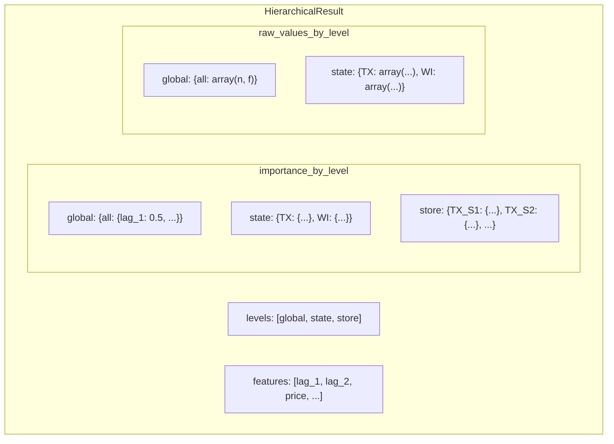
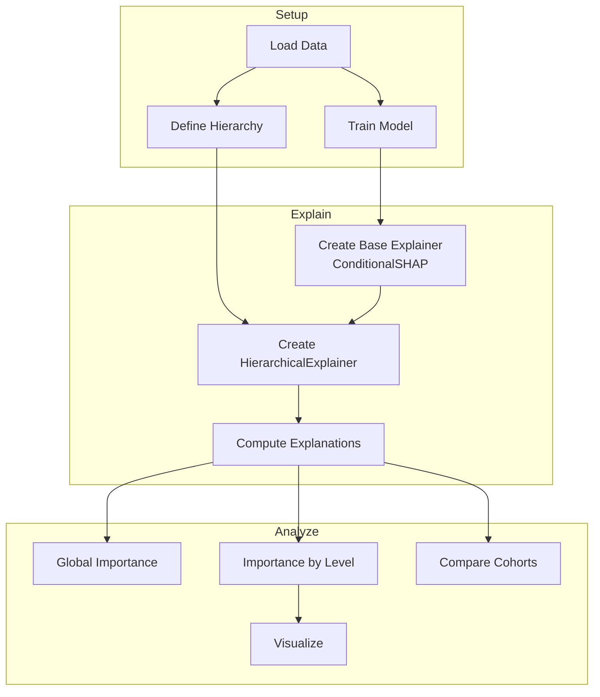

# Hierarchy Module

The hierarchy module provides tools for defining hierarchical structures and aggregating feature importance across multiple levels.

## Location

`xeries/hierarchy/`

## Architecture



## Components

### HierarchyDefinition (`definition.py`)

Defines the hierarchical structure for multi-series data.

**Strategies:**



**Usage:**

```python
from xeries.hierarchy import HierarchyDefinition

# Column-based (most common)
hierarchy = HierarchyDefinition(
    levels=['state', 'store', 'product'],
    columns=['state_id', 'store_id', 'product_id']
)

# Parse pattern from series_id
hierarchy = HierarchyDefinition(
    levels=['state', 'store'],
    parse_pattern=r'(?P<state>\w{2})_(?P<store>\w+)',
    series_col='series_id'
)

# Explicit mapping
hierarchy = HierarchyDefinition(
    levels=['region'],
    mapping={
        'TX_S1': {'region': 'South'},
        'TX_S2': {'region': 'South'},
        'WI_S1': {'region': 'North'},
    }
)
```

---

### HierarchicalAggregator (`aggregator.py`)

Aggregates feature importance results across hierarchy levels.

**Aggregation Formula (SHAP):**

$$\phi_i(C_k) = \frac{1}{|C_k|} \sum_{x \in C_k} |\phi_i(x)|$$

Where:
- $\phi_i(C_k)$ = Mean absolute SHAP for feature $i$ in cohort $C_k$
- $|C_k|$ = Number of samples in cohort



**Usage:**

```python
from xeries.hierarchy import HierarchyDefinition, HierarchicalAggregator

hierarchy = HierarchyDefinition(
    levels=['state', 'store'],
    columns=['state_id', 'store_id']
)
aggregator = HierarchicalAggregator(hierarchy)

# Aggregate SHAP results
hier_result = aggregator.aggregate_shap(
    shap_result, 
    X, 
    include_raw=True  # Store raw values for violin plots
)

# Aggregate permutation importance (re-computes per cohort)
hier_result = aggregator.aggregate_importance(
    pfi_result, X, y,
    model=model,
    metric='mse',
    n_repeats=5
)
```

---

### HierarchicalExplainer (`explainer.py`)

Wrapper that combines a base explainer with hierarchical aggregation.



**Usage:**

```python
from xeries import ConditionalSHAP
from xeries.hierarchy import HierarchyDefinition, HierarchicalExplainer

# Define hierarchy
hierarchy = HierarchyDefinition(
    levels=['state', 'store'],
    columns=['state_id', 'store_id']
)

# Create hierarchical explainer
base = ConditionalSHAP(model, X_train, series_col='level')
explainer = HierarchicalExplainer(base, hierarchy)

# Compute hierarchical results
result = explainer.explain(X_test, include_raw=True)

# Access at different levels
global_imp = result.get_global()
state_df = result.get_level_df('state')
store_df = result.get_level_df('store')

# Compare cohorts
comparison = explainer.compare_cohorts(X_test, level='state', top_n=5)

# Feature ranking stability
stability = explainer.feature_ranking_stability(X_test, level='store')
```

---

### HierarchicalResult (`types.py`)

Container for multi-level aggregated importance results.

**Structure:**



**Methods:**

```python
# Get DataFrame for a level (cohorts as rows, features as columns)
state_df = result.get_level_df('state')

# Get global importance as dict
global_imp = result.get_global()

# Get cohorts at a level
cohorts = result.get_cohorts_at_level('store')  # ['TX_S1', 'TX_S2', ...]

# Get raw SHAP values for violin plots
raw_values = result.get_raw_values('state', 'TX')  # array(n_samples, n_features)
```

## Example Workflow


