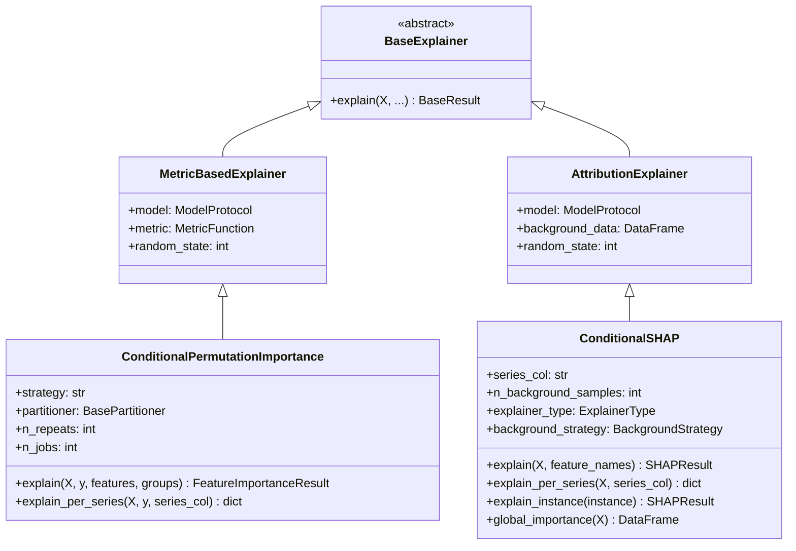
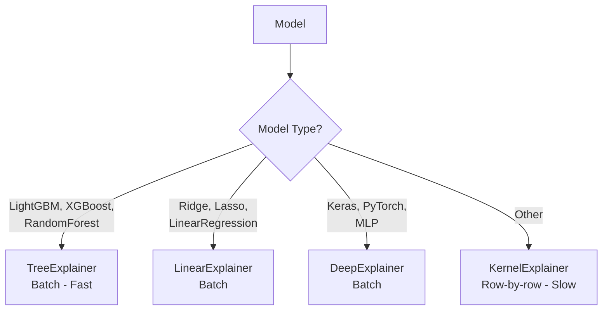
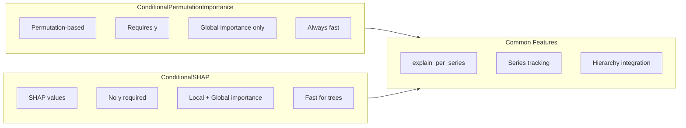

# Importance Module

The importance module provides feature importance methods for multi-series forecasting models.

## Location

`xeries/importance/`

## Class Diagram



## Components

### ConditionalPermutationImportance (`permutation.py`)

Conditional Permutation Feature Importance (cs-PFI) calculator that permutes features only within meaningful subgroups.

```python
class ConditionalPermutationImportance(MetricBasedExplainer):
    """Conditional Permutation Feature Importance calculator."""

    def __init__(
        self,
        model: ModelProtocol,
        metric: MetricFunction | str = "mse",
        strategy: str = "auto",
        partitioner: BasePartitioner | None = None,
        n_repeats: int = 5,
        n_jobs: int = -1,
        random_state: int | None = None,
    ):
        ...
```

**Parameters:**
- `model` - Model with `predict()` method
- `metric` - Scoring metric ('mse', 'mae', 'rmse', 'r2', or callable)
- `strategy` - 'auto' (tree-based) or 'manual' (user-defined groups)
- `partitioner` - Custom partitioner instance
- `n_repeats` - Number of permutation repeats
- `n_jobs` - Parallel jobs (-1 for all cores)
- `random_state` - Random seed

**Methods:**

```python
def explain(
    self,
    X: pd.DataFrame,
    y: ArrayLike,
    features: list[str] | None = None,
    groups: GroupLabels | None = None,
) -> FeatureImportanceResult:
    """Compute conditional permutation importance."""
    ...

def explain_per_series(
    self,
    X: pd.DataFrame,
    y: ArrayLike,
    series_col: str,
    features: list[str] | None = None,
    min_samples: int = 10,
) -> dict[Any, FeatureImportanceResult]:
    """Compute importance separately for each series."""
    ...
```

**Example:**

```python
from xeries import ConditionalPermutationImportance

explainer = ConditionalPermutationImportance(
    model=model,
    metric='mse',
    strategy='auto',  # Tree-based cs-PFI
    n_repeats=10,
)

# Global importance
result = explainer.explain(X, y, features=['lag_1', 'lag_2', 'price'])
print(result.to_dataframe())

# Per-series importance
per_series = explainer.explain_per_series(X, y, series_col='level')
for series_id, res in per_series.items():
    print(f"{series_id}: {res.to_dataframe()}")
```

---

### ConditionalSHAP (`shap.py`)

Conditional SHAP explainer with auto-detection of optimal explainer type and support for batch computation.

```python
class ConditionalSHAP(AttributionExplainer):
    """Conditional SHAP explainer for multi-series forecasting models."""

    SUPPORTED_EXPLAINER_TYPES = ("tree", "linear", "kernel", "deep", "auto")

    def __init__(
        self,
        model: ModelProtocol,
        background_data: pd.DataFrame,
        series_col: str = "level",
        n_background_samples: int = 100,
        explainer_type: ExplainerType = "auto",
        explainer: Any = None,
        background_strategy: BackgroundStrategy = "series",
        random_state: int | None = None,
    ):
        ...
```

**Parameters:**
- `model` - Model with `predict()` method
- `background_data` - Dataset for background samples
- `series_col` - Column containing series identifiers
- `n_background_samples` - Number of background samples per series/cohort
- `explainer_type` - SHAP explainer type:
  - `'auto'` - Auto-detect based on model type (recommended)
  - `'tree'` - TreeExplainer (fast, for tree models)
  - `'kernel'` - KernelExplainer (slow, model-agnostic)
  - `'linear'` - LinearExplainer (for linear models)
  - `'deep'` - DeepExplainer (for neural networks)
- `explainer` - Pre-created SHAP explainer (optional)
- `background_strategy` - Background selection:
  - `'series'` - Series-specific backgrounds
  - `'global'` - Shared global background

**Methods:**

```python
def explain(
    self,
    X: pd.DataFrame,
    feature_names: list[str] | None = None,
) -> SHAPResult:
    """Compute SHAP values for the given instances."""
    ...

def explain_per_series(
    self,
    X: pd.DataFrame,
    series_col: str | None = None,
    feature_names: list[str] | None = None,
    min_samples: int = 10,
) -> dict[Any, SHAPResult]:
    """Compute SHAP values separately for each series."""
    ...

def explain_instance(
    self,
    instance: pd.Series | pd.DataFrame,
    feature_names: list[str] | None = None,
) -> SHAPResult:
    """Explain a single instance."""
    ...

def global_importance(
    self,
    X: pd.DataFrame,
    n_samples: int | None = None,
) -> pd.DataFrame:
    """Compute global feature importance from SHAP values."""
    ...
```

**Explainer Type Auto-Detection:**



| Model Type | Detected Explainer | Computation |
|------------|-------------------|-------------|
| LightGBM, XGBoost, RandomForest, GradientBoosting | TreeExplainer | Batch (fast) |
| Ridge, Lasso, LinearRegression | LinearExplainer | Batch |
| Keras, PyTorch, MLP | DeepExplainer | Batch |
| Other | KernelExplainer | Row-by-row |

**Example:**

```python
from xeries import ConditionalSHAP

# Auto-detects TreeExplainer for RandomForest
explainer = ConditionalSHAP(
    model=rf_model,
    background_data=X_train,
    series_col='level',
)

# Fast batch computation
result = explainer.explain(X_test)
print(result.mean_abs_shap())

# Per-series analysis
per_series = explainer.explain_per_series(X_test)
for series_id, res in per_series.items():
    print(f"{series_id}: {res.mean_abs_shap()}")

# With series tracking for aggregation
print(result.series_ids.unique())
importance_by_series = result.mean_abs_shap_by_series()
```

**KernelExplainer with Series-Specific Background:**

```python
explainer = ConditionalSHAP(
    model=model,
    background_data=X_train,
    series_col='level',
    explainer_type='kernel',
    background_strategy='series',  # Series-specific backgrounds
    n_background_samples=50,
)
```

## Comparison



| Feature | ConditionalPermutationImportance | ConditionalSHAP |
|---------|----------------------------------|-----------------|
| Method | Permutation-based | SHAP values |
| Speed | Fast | Fast (tree) / Slow (kernel) |
| Local importance | No | Yes |
| Model-agnostic | Yes | Yes (kernel) |
| Requires y | Yes | No |
| Series tracking | Yes | Yes |
| Per-series method | `explain_per_series()` | `explain_per_series()` |
