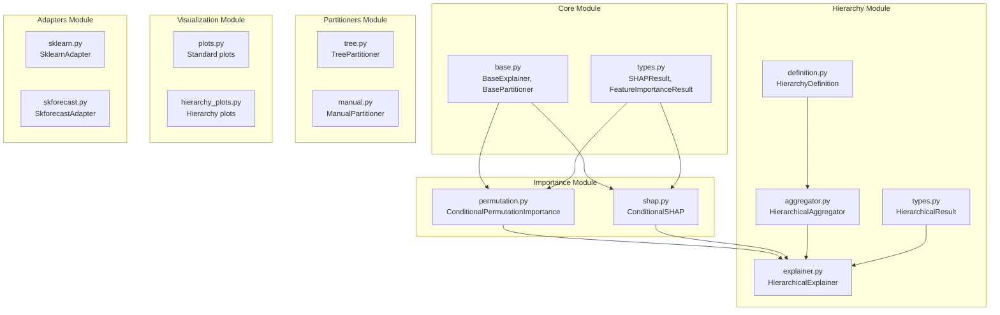
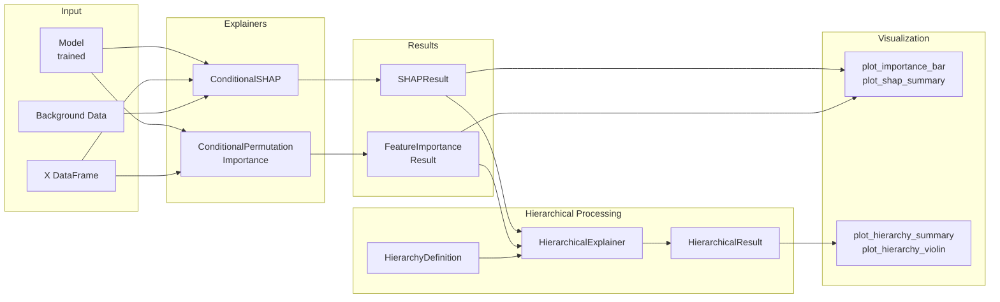

# Architecture Overview

This section provides a comprehensive overview of the xeries library architecture, designed for explainability in multi-time series forecasting.

## High-Level Architecture



## Design Principles

### 1. Unified Explainer Interface

All explainers inherit from `BaseExplainer` and implement the `explain()` method:

```python
class BaseExplainer(ABC):
    @abstractmethod
    def explain(self, X: pd.DataFrame, *args, **kwargs) -> BaseResult:
        ...
```

### 2. Composable Architecture

Components can be composed together:

```python
# Compose explainer with hierarchy
base_explainer = ConditionalSHAP(model, X_train, series_col='level')
hierarchical = HierarchicalExplainer(base_explainer, hierarchy)
result = hierarchical.explain(X_test)
```

### 3. Result-Oriented Design

All methods return typed result objects with utility methods:

- `SHAPResult` - SHAP values with `mean_abs_shap()`, `to_dataframe()`, `mean_abs_shap_by_series()`
- `FeatureImportanceResult` - Permutation importance with `to_dataframe()`
- `HierarchicalResult` - Multi-level aggregated results with `get_level_df()`, `get_global()`

## Module Documentation

- [Core Module](core.md) - Base classes and type definitions
- [Importance Module](importance.md) - Feature importance methods
- [Hierarchy Module](hierarchy.md) - Hierarchical aggregation
- [Partitioners Module](partitioners.md) - Data partitioning strategies
- [Visualization Module](visualization.md) - Plotting utilities
- [Adapters Module](adapters.md) - Framework integrations

## Data Flow



## Workflow Examples

### Basic Workflow

```python
from xeries import ConditionalSHAP

# 1. Create explainer
explainer = ConditionalSHAP(model, X_train, series_col='level')

# 2. Compute explanations
result = explainer.explain(X_test)

# 3. Analyze results
print(result.mean_abs_shap())
```

### Hierarchical Workflow

```python
from xeries import ConditionalSHAP
from xeries.hierarchy import HierarchyDefinition, HierarchicalExplainer
from xeries.visualization import plot_hierarchy_summary

# 1. Define hierarchy
hierarchy = HierarchyDefinition(
    levels=['state', 'store'],
    columns=['state_id', 'store_id']
)

# 2. Create hierarchical explainer
base = ConditionalSHAP(model, X_train, series_col='level')
explainer = HierarchicalExplainer(base, hierarchy)

# 3. Compute hierarchical results
result = explainer.explain(X_test, include_raw=True)

# 4. Visualize
plot_hierarchy_summary(result)
```

### Per-Series Workflow

```python
from xeries import ConditionalPermutationImportance, ConditionalSHAP

# Permutation importance per series
pfi_explainer = ConditionalPermutationImportance(model, metric='mse')
pfi_results = pfi_explainer.explain_per_series(X, y, series_col='level')

# SHAP values per series
shap_explainer = ConditionalSHAP(model, X_train, series_col='level')
shap_results = shap_explainer.explain_per_series(X_test)
```
