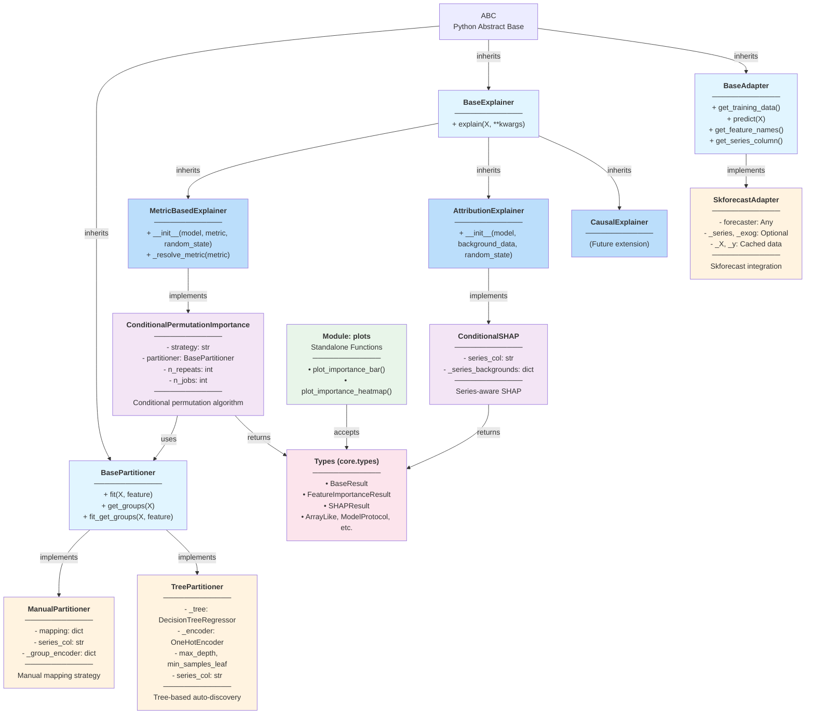
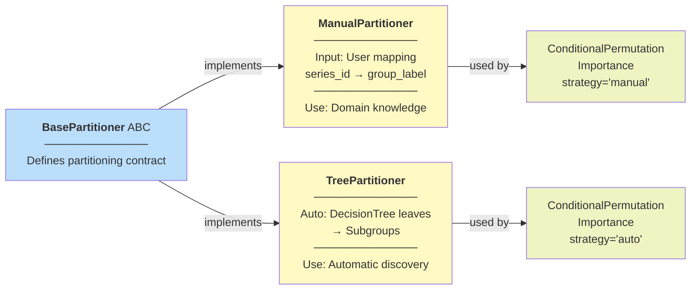
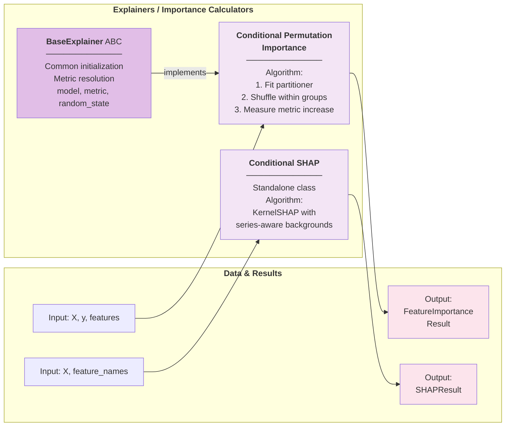
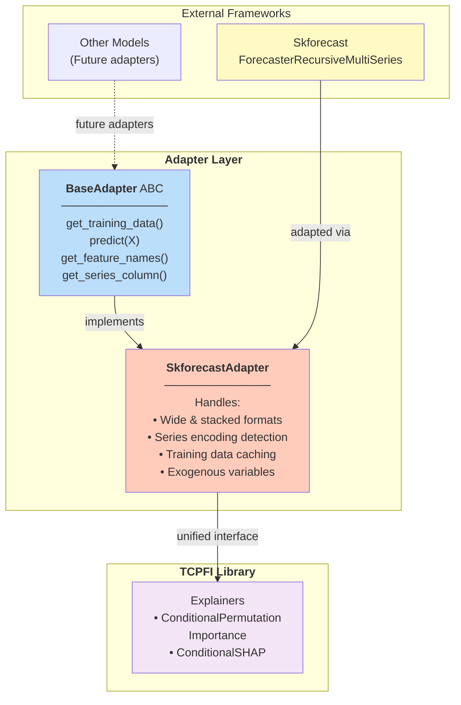
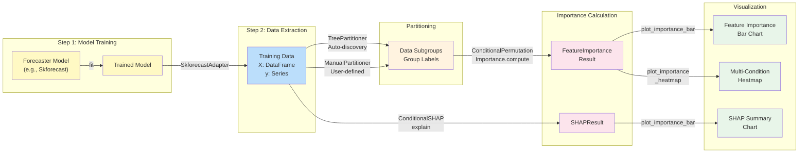
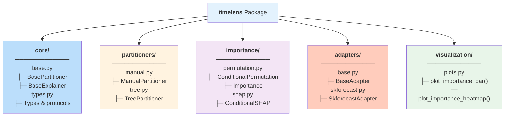
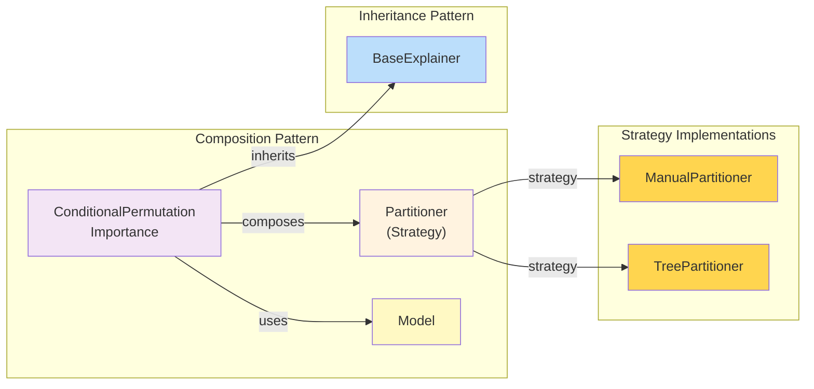

# API Architecture - Mermaid Diagrams

## 1. Complete Inheritance Hierarchy

---

## 2. Partitioner Inheritance & Usage

---

## 3. Explainer Hierarchy & Data Flow

---

## 4. Adapter Pattern - Framework Integration

---

## 5. Complete Data Flow - From Model to Visualization

---

## 6. Module Organization

---

## 7. Composition Relationships

---

## Color Legend

| Color | Meaning |
|-------|---------|
| 🔵 Light Blue | Abstract Base Classes |
| 🟨 Orange/Yellow | Concrete Implementations |
| 🟣 Purple | Explainers/Importance |
| 🟠 Orange | Adapters |
| 🟢 Green | Visualization/Utilities |
| 🩷 Pink | Result Types |

