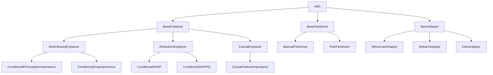
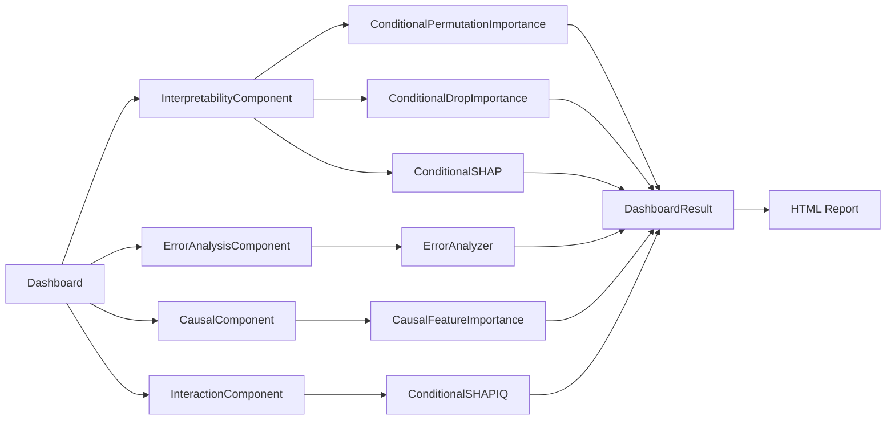
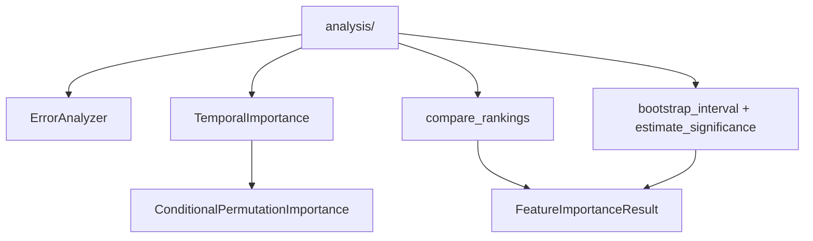
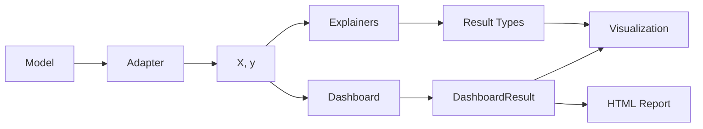
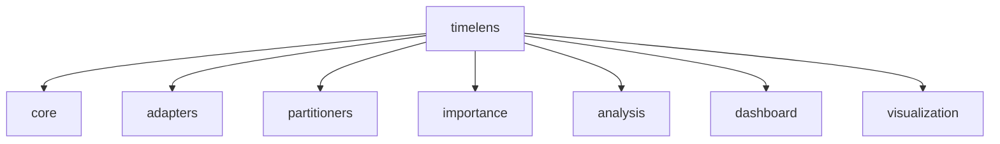

# API Architecture - Mermaid Diagrams

## 1. Core Inheritance Hierarchy

```mermaid
graph TD
    ABC[ABC]

    ABC --> BasePartitioner[BasePartitioner]
    ABC --> BaseExplainer[BaseExplainer]
    ABC --> BaseAdapter[BaseAdapter]

    BaseExplainer --> MetricBasedExplainer[MetricBasedExplainer]
    BaseExplainer --> AttributionExplainer[AttributionExplainer]
    BaseExplainer --> CausalExplainer[CausalExplainer]

    BasePartitioner --> ManualPartitioner[ManualPartitioner]
    BasePartitioner --> TreePartitioner[TreePartitioner]

    MetricBasedExplainer --> ConditionalPermutationImportance
    MetricBasedExplainer --> ConditionalDropImportance
    AttributionExplainer --> ConditionalSHAP
    AttributionExplainer --> ConditionalSHAPIQ
    CausalExplainer --> CausalFeatureImportance

    BaseAdapter --> SkforecastAdapter
    BaseAdapter --> SklearnAdapter
    BaseAdapter --> DartsAdapter
```

## 2. Dashboard Orchestration Flow

```mermaid
graph LR
    Dashboard --> InterpretabilityComponent
    Dashboard --> ErrorAnalysisComponent
    Dashboard --> CausalComponent
    Dashboard --> InteractionComponent

    InterpretabilityComponent --> ConditionalPermutationImportance
    InterpretabilityComponent --> ConditionalDropImportance
    InterpretabilityComponent --> ConditionalSHAP

    ErrorAnalysisComponent --> ErrorAnalyzer
    CausalComponent --> CausalFeatureImportance
    InteractionComponent --> ConditionalSHAPIQ

    ConditionalPermutationImportance --> DashboardResult
    ConditionalDropImportance --> DashboardResult
    ConditionalSHAP --> DashboardResult
    ErrorAnalyzer --> DashboardResult
    CausalFeatureImportance --> DashboardResult
    ConditionalSHAPIQ --> DashboardResult

    DashboardResult --> Report[HTML Report]
```

## 3. Analysis Utilities

```mermaid
graph TD
    Analysis[analysis/]
    Analysis --> ErrorAnalyzer
    Analysis --> TemporalImportance
    Analysis --> CompareRankings[compare_rankings]
    Analysis --> Significance[bootstrap_interval + estimate_significance]

    TemporalImportance --> ConditionalPermutationImportance
    CompareRankings --> FeatureImportanceResult
    Significance --> FeatureImportanceResult
```

## 4. End-to-End Workflow

```mermaid
graph LR
    A[Model] --> B[Adapter]
    B --> C[X, y]
    C --> D[Explainers]
    C --> E[Dashboard]

    D --> F[Result Types]
    E --> G[DashboardResult]

    F --> H[Visualization]
    G --> H
    G --> I[HTML Report]
```

## 5. Module Organization

```mermaid
graph TD
    timelens --> core
    timelens --> adapters
    timelens --> partitioners
    timelens --> importance
    timelens --> analysis
    timelens --> dashboard
    timelens --> visualization
```
