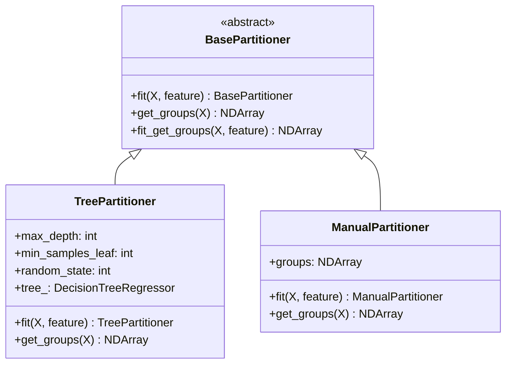
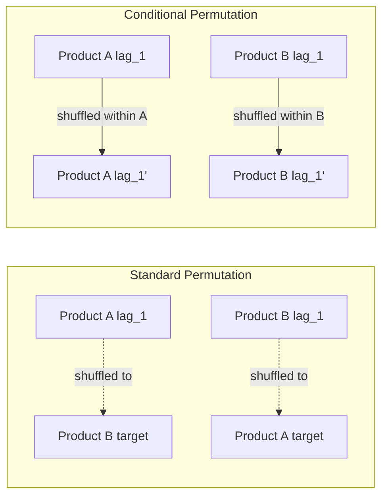
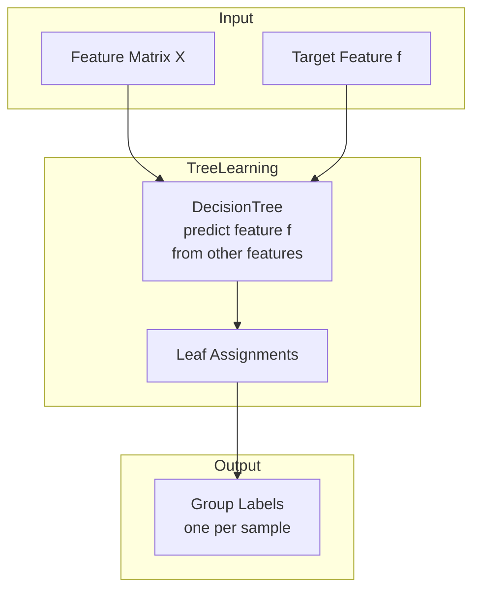
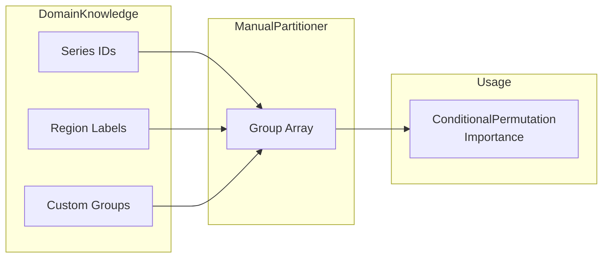
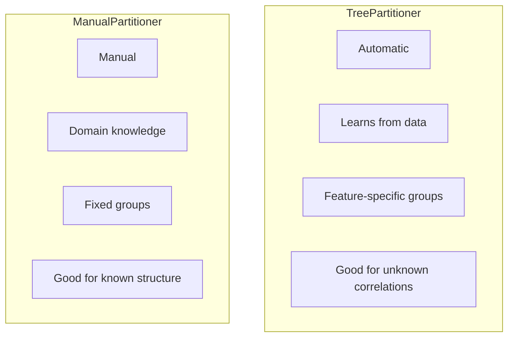

# Partitioners Module

The partitioners module provides strategies for dividing data into subgroups for conditional permutation.

## Location

`xeries/partitioners/`

## Architecture



## Purpose



## Components

### TreePartitioner (`tree.py`)

Automatically learns homogeneous subgroups using a decision tree (cs-PFI method).



**How it works:**
1. Train a decision tree to predict feature `f` from other features
2. Each leaf node becomes a group
3. Samples in the same leaf have similar feature relationships
4. Permuting within leaves preserves correlations

**Usage:**

```python
from xeries.partitioners import TreePartitioner

partitioner = TreePartitioner(
    max_depth=5,
    min_samples_leaf=20,
    random_state=42
)

# Fit and get groups
groups = partitioner.fit_get_groups(X, feature='lag_1')

# Use with ConditionalPermutationImportance
from xeries import ConditionalPermutationImportance

explainer = ConditionalPermutationImportance(
    model=model,
    metric='mse',
    strategy='auto',  # Uses TreePartitioner internally
    # Or provide custom partitioner:
    # partitioner=TreePartitioner(max_depth=3)
)
```

---

### ManualPartitioner (`manual.py`)

Uses pre-defined groups based on domain knowledge.



**Usage:**

```python
from xeries.partitioners import ManualPartitioner
import numpy as np

# Create groups from series IDs
series_ids = X.index.get_level_values('level')
groups = pd.factorize(series_ids)[0]

partitioner = ManualPartitioner(groups=groups)

# Use with explainer
from xeries import ConditionalPermutationImportance

explainer = ConditionalPermutationImportance(
    model=model,
    metric='mse',
    strategy='manual',
    partitioner=partitioner
)

result = explainer.explain(X, y)

# Or pass groups directly
result = explainer.explain(X, y, groups=groups)
```

## Comparison



| Feature | TreePartitioner | ManualPartitioner |
|---------|-----------------|-------------------|
| Group Definition | Automatic (learned) | Manual (user-defined) |
| Feature-Specific | Yes (different groups per feature) | No (same groups for all) |
| Requires Domain Knowledge | No | Yes |
| Computational Cost | Higher (fits tree per feature) | Lower |
| Best For | Unknown correlations | Known series structure |

## Example: Series-Based Grouping

```python
# For multi-series data, often the simplest approach is
# to permute within each series

from xeries import ConditionalPermutationImportance

# Get series IDs from MultiIndex
series_ids = X.index.get_level_values('level')
groups = pd.factorize(series_ids)[0]

explainer = ConditionalPermutationImportance(
    model=model,
    metric='mse',
    strategy='manual'
)

result = explainer.explain(X, y, groups=groups)
```
