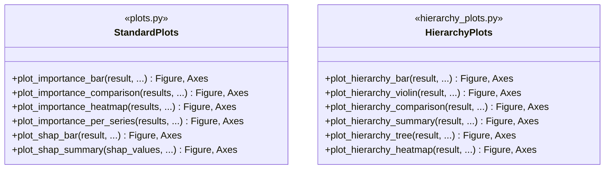
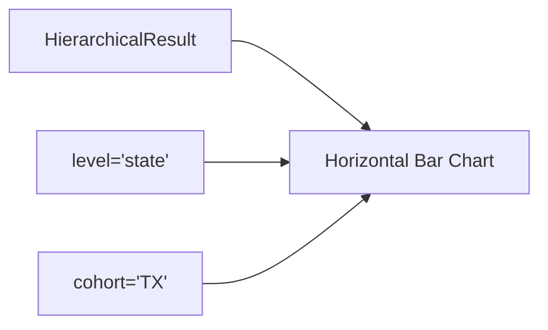
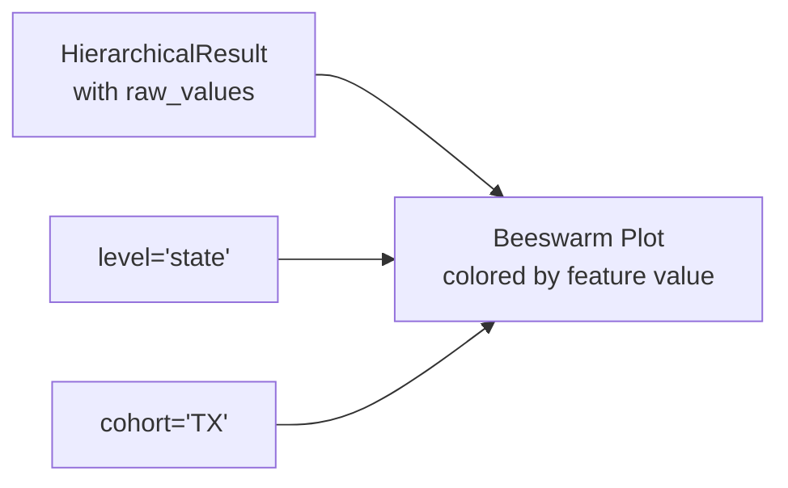
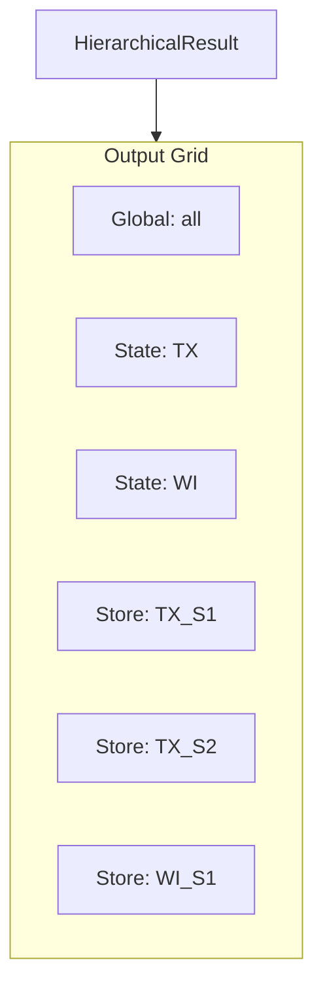
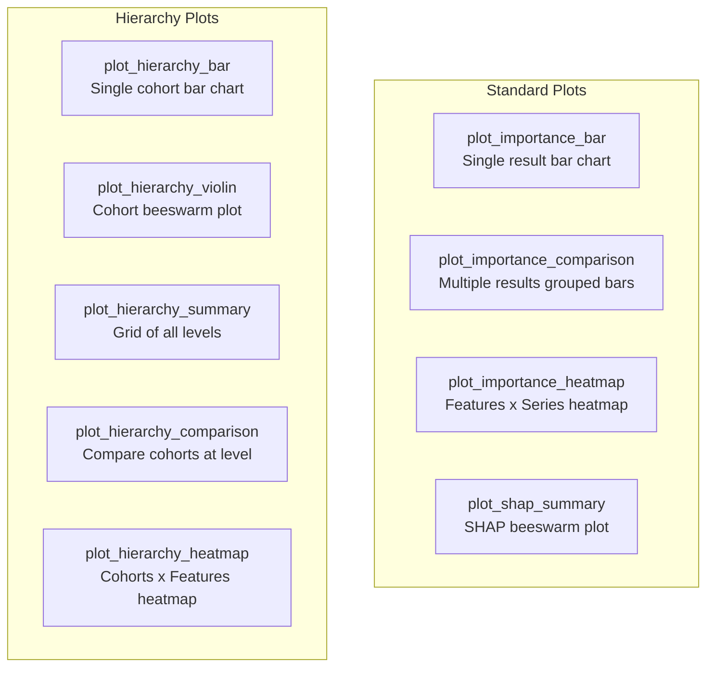

# Visualization Module

The visualization module provides plotting utilities for feature importance results.

## Location

`xeries/visualization/`

## Architecture



## Standard Plots (`plots.py`)

### plot_importance_bar

Horizontal bar chart of feature importance.


```python
from xeries.visualization import plot_importance_bar

fig, ax = plot_importance_bar(
    result,
    top_n=10,
    figsize=(10, 6),
    title="Feature Importance"
)
```

### plot_importance_comparison

Compare importance across multiple results.


```python
from xeries.visualization import plot_importance_comparison

results = {
    'Series A': result_a,
    'Series B': result_b,
}

fig, ax = plot_importance_comparison(
    results,
    top_n=5,
    figsize=(12, 6)
)
```

### plot_importance_heatmap

Heatmap of importance across series.


```python
from xeries.visualization import plot_importance_heatmap

per_series_results = explainer.explain_per_series(X, y, series_col='level')

fig, ax = plot_importance_heatmap(
    per_series_results,
    top_n=10,
    figsize=(12, 8)
)
```

### plot_shap_summary

SHAP summary plot (beeswarm style).

```python
from xeries.visualization import plot_shap_summary

fig, ax = plot_shap_summary(
    result.shap_values,
    result.data,
    result.feature_names,
    max_display=10
)
```

---

## Hierarchy Plots (`hierarchy_plots.py`)

### plot_hierarchy_bar

Bar chart for a specific hierarchy level and cohort.



```python
from xeries.visualization import plot_hierarchy_bar

fig, ax = plot_hierarchy_bar(
    result,
    level='state',
    cohort='TX',
    top_n=10
)
```

### plot_hierarchy_violin

SHAP beeswarm/violin plot for a cohort.



```python
from xeries.visualization import plot_hierarchy_violin

# Requires include_raw=True when computing
result = explainer.explain(X, include_raw=True)

fig, ax = plot_hierarchy_violin(
    result,
    level='state',
    cohort='TX',
    top_n=10
)
```

### plot_hierarchy_summary

Grid of plots for all hierarchy levels.



```python
from xeries.visualization import plot_hierarchy_summary

fig, axes = plot_hierarchy_summary(
    result,
    levels=None,  # All levels
    top_n=5,
    figsize=(15, 10)
)
```

### plot_hierarchy_comparison

Grouped bar chart comparing cohorts at a level.

```python
from xeries.visualization import plot_hierarchy_comparison

fig, ax = plot_hierarchy_comparison(
    result,
    level='state',
    top_n=5,
    figsize=(12, 6)
)
```

### plot_hierarchy_heatmap

Heatmap of importance across cohorts.

```python
from xeries.visualization import plot_hierarchy_heatmap

fig, ax = plot_hierarchy_heatmap(
    result,
    level='store',
    top_n=10,
    figsize=(12, 8)
)
```

## Usage Example

```python
from xeries import ConditionalSHAP
from xeries.hierarchy import HierarchyDefinition, HierarchicalExplainer
from xeries.visualization import (
    plot_hierarchy_summary,
    plot_hierarchy_bar,
    plot_hierarchy_violin,
    plot_hierarchy_comparison
)
import matplotlib.pyplot as plt

# Setup
hierarchy = HierarchyDefinition(
    levels=['state', 'store'],
    columns=['state_id', 'store_id']
)
base = ConditionalSHAP(model, X_train, series_col='level')
explainer = HierarchicalExplainer(base, hierarchy)

# Compute with raw values for violin plots
result = explainer.explain(X_test, include_raw=True)

# Summary grid
fig, axes = plot_hierarchy_summary(result)
plt.suptitle("Feature Importance Across Hierarchy")
plt.show()

# State comparison
fig, ax = plot_hierarchy_comparison(result, level='state', top_n=5)
plt.show()

# Violin plot for TX
fig, ax = plot_hierarchy_violin(result, level='state', cohort='TX')
plt.show()
```

## Plot Gallery


