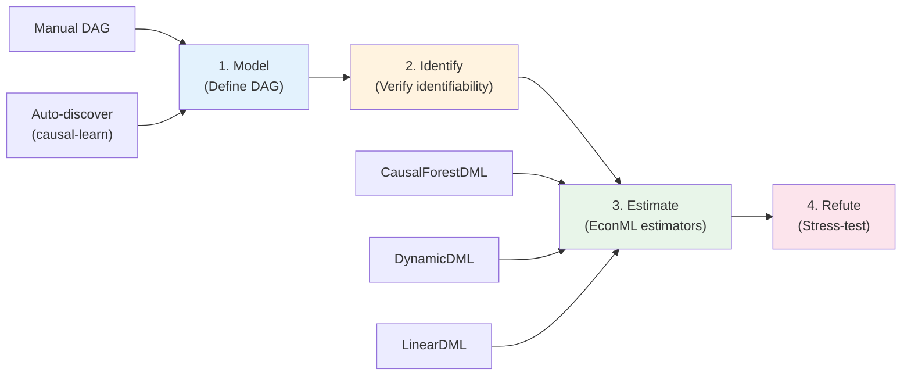
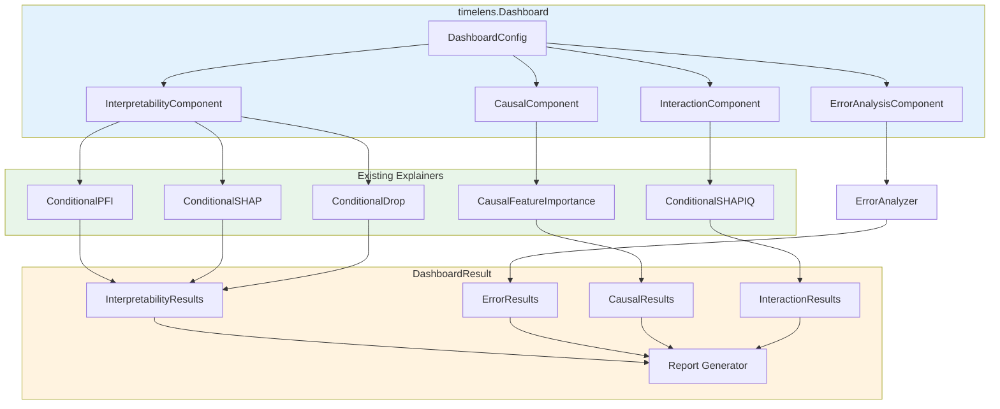
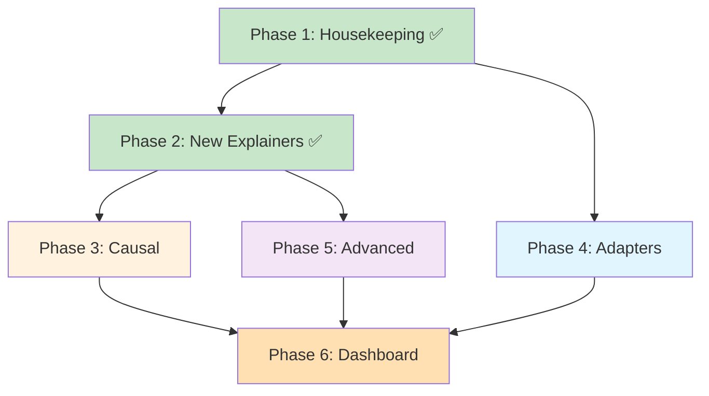

# TimeLens Extension Plan (Updated)

## Completed Work

| Phase | Status | Tests | Coverage |
|-------|--------|-------|----------|
| **Phase 1**: Housekeeping (doc fixes, viz tests, adapter tests) | ✅ Done | +33 | 79% viz, 76% adapters |
| **Phase 2B**: `ConditionalDropImportance` | ✅ Done | +12 | 96% |
| **Phase 2A**: `ConditionalSHAPIQ` + `SHAPIQResult` | ✅ Done | +12 | 86% |
| **Full suite** | ✅ 86 tests, all checks pass | 86 | 87% overall |

---

## Phase 3: Causal Feature Importance

**Goal**: Implement causal inference for time-series feature importance using the DoWhy + EconML stack.
**Estimated effort**: Large

> [!IMPORTANT]
> This is the core research differentiator. While standard PFI/SHAP answer *"which features does the model rely on?"*, causal importance answers *"which features actually **cause** changes in the outcome?"* — essential for actionable insights in forecasting.

### Background & Sources

| Approach | Description | Library |
|----------|-------------|---------|
| **Causal SHAP** | SHAP with do-calculus interventional expectations | [Heskes et al. (NeurIPS 2020)](https://proceedings.neurips.cc/paper/2020) |
| **DoWhy Pipeline** | 4-step: Model→Identify→Estimate→Refute | [PyWhy/DoWhy](https://www.pywhy.org/) |
| **EconML Estimation** | Heterogeneous treatment effects via ML | [Microsoft/EconML](https://github.com/microsoft/EconML) |
| **DynamicDML** | Time-varying treatment effects | `econml.dynamic.dml` |
| **Causal Forest** | Non-parametric CATE estimation | `econml.dml.CausalForestDML` |
| **causal-learn** | Automatic causal graph discovery (PC, GES, FCI) | [cmu-phil/causal-learn](https://github.com/cmu-phil/causal-learn) |

### Design: DoWhy 4-Step Pipeline Adapted for Multi-Series



### Time-Series Specific Considerations

1. **Series-conditional treatment effects**: Estimate how a treatment (e.g. promotion) affects the outcome *differently per series group*
2. **Dynamic effects**: Use `DynamicDML` when treatment at time $t$ affects outcomes at $t+1, t+2, ...$
3. **Temporal confounders**: Lag features, rolling stats, and trends must be included as confounders ($W$)
4. **Series identifier as confounder**: The series ID itself can confound treatment-outcome relationships

### Proposed API

```python
from timelens.importance.causal import CausalFeatureImportance

# Option A: User provides a causal graph
import networkx as nx
dag = nx.DiGraph([
    ("promotion", "sales"),
    ("price", "sales"),
    ("season", "sales"),
    ("season", "promotion"),  # confounder
])

causal = CausalFeatureImportance(
    model=adapter,
    causal_graph=dag,
    treatment_features=["promotion", "price"],
    estimator="causal_forest",     # or "dynamic_dml", "linear_dml"
    series_col="level",
    random_state=42,
)

result = causal.explain(X, y)
print(result.to_dataframe())
# feature  |  avg_treatment_effect  |  std  |  p_value

# Option B: Auto-discover graph
causal_auto = CausalFeatureImportance(
    model=adapter,
    treatment_features=["promotion"],
    discover_graph=True,           # uses causal-learn PC algorithm
    series_col="level",
)
result = causal_auto.explain(X, y)
result.plot_graph()                # Visualize discovered DAG

# Refutation (stress-test)
refutation = causal.refute(result, method="placebo_treatment")
print(refutation)  # Should show ~0 effect
```

### Files

#### [NEW] [causal.py](file:///e:/repos/time_conditional_pfi/src/timelens/importance/causal.py)
```
CausalFeatureImportance(CausalExplainer)
├── __init__(model, causal_graph=None, treatment_features=None,
│            estimator='causal_forest', series_col='level', ...)
├── explain(X, y, features=None) → CausalResult
├── discover_graph(X, method='pc') → nx.DiGraph
├── refute(result, method='placebo') → RefutationResult
├── _build_dowhy_model(X, y, treatment) → dowhy.CausalModel
├── _estimate_effects(causal_model) → dict
└── _series_conditional_effects(X, y) → dict[str, float]
```

#### [MODIFY] [types.py](file:///e:/repos/time_conditional_pfi/src/timelens/core/types.py)
```python
@dataclass
class CausalResult(BaseResult):
    feature_names: list[str]
    treatment_effects: NDArray        # Average Treatment Effect per feature
    confidence_intervals: NDArray     # (lower, upper) per feature
    p_values: NDArray | None
    causal_graph: Any                 # nx.DiGraph
    estimator_name: str
    refutation: RefutationResult | None = None

    def to_dataframe(self) → pd.DataFrame: ...
    def significant_features(self, alpha=0.05) → list[str]: ...

@dataclass
class RefutationResult(BaseResult):
    method: str
    original_effect: float
    refuted_effect: float
    p_value: float | None
    passed: bool                      # True if refutation confirms estimate
```

#### [MODIFY] [base.py](file:///e:/repos/time_conditional_pfi/src/timelens/core/base.py)
- Flesh out `CausalExplainer` with proper `__init__` and abstract interface

#### [MODIFY] [pyproject.toml](file:///e:/repos/time_conditional_pfi/pyproject.toml)
```toml
[project.optional-dependencies]
causal = ["dowhy>=0.11", "econml>=0.15"]
causal-discovery = ["causal-learn>=0.1.3"]
all = ["timelens[skforecast,shapiq,causal]"]
```

#### [NEW] [test_causal.py](file:///e:/repos/time_conditional_pfi/tests/unit/test_causal.py)

---

## Phase 4: Framework Adapters

*(Unchanged from original plan — `SklearnAdapter`, `DartsAdapter`)*

---

## Phase 5: Advanced Features

*(Unchanged from original plan — Temporal windowed importance, significance testing, comparison utilities)*

---

## Phase 6: Unified Dashboard API *(NEW)*

**Goal**: A single entry-point that orchestrates all explainers, inspired by [Azure's Responsible AI Dashboard](https://learn.microsoft.com/en-us/azure/machine-learning/concept-responsible-ai-dashboard).
**Estimated effort**: Large

> [!IMPORTANT]
> This is the **top-level user-facing API** that ties everything together. Just as Azure RAI provides a unified dashboard for model debugging + decision-making, TimeLens Dashboard provides a unified dashboard for **time-series explainability**.

### Azure RAI → TimeLens Mapping

| Azure RAI Component | TimeLens Equivalent | Status |
|---------------------|---------------------|--------|
| Model interpretability | `ConditionalPFI`, `ConditionalSHAP`, `ConditionalSHAPIQ`, `ConditionalDrop` | ✅ |
| Error analysis | `ErrorAnalysis` (per-series, per-window performance) | 🆕 |
| Causal inference | `CausalFeatureImportance` (DoWhy/EconML) | Phase 3 |
| Counterfactual what-if | `CounterfactualAnalysis` (DiCE integration) | 🆕 Future |
| Data analysis | `SeriesAnalysis` (distribution stats per series) | 🆕 |
| Fairness assessment | `SeriesFairness` (model performance equity across series) | 🆕 |
| Scorecard/Report | `DashboardReport` (HTML/PDF export) | 🆕 |

### Proposed Dashboard API

```python
import timelens

# ─── 1. Create Dashboard ───
dashboard = timelens.Dashboard(
    model=adapter,           # Any model with .predict()
    X=X_train,
    y=y_train,
    series_col="level",      # Series identifier
)

# ─── 2. Add Components (Builder Pattern) ───
# Each .add_*() returns `self` for chaining

dashboard.add_interpretability(
    methods=["permutation", "shap", "dropping"],
    strategy="auto",
    features=["lag_1", "lag_2", "day_of_week"],
    n_repeats=5,
)

dashboard.add_error_analysis(
    metrics=["mse", "mae", "rmse"],
    by_series=True,          # breakdown per series
    by_time_window=True,     # breakdown per time window
    window_size=24,
)

dashboard.add_causal_analysis(
    treatment_features=["promotion", "price"],
    causal_graph=dag,        # optional
    estimator="causal_forest",
)

dashboard.add_interactions(
    method="shapiq",
    max_order=2,
    n_samples=100,           # subsample for speed
)

# ─── 3. Compute All ───
results = dashboard.compute()

# ─── 4. Access Results ───
# Structured result container with attribute access
results.interpretability.permutation     # → FeatureImportanceResult
results.interpretability.shap            # → SHAPResult
results.interpretability.dropping        # → FeatureImportanceResult
results.error_analysis.by_series         # → pd.DataFrame
results.error_analysis.by_time_window    # → pd.DataFrame
results.causal.treatment_effects         # → CausalResult
results.interactions.shapiq              # → SHAPIQResult

# ─── 5. Compare Methods ───
results.compare_rankings()               # Kendall tau between PFI vs SHAP vs causal
results.summary()                        # Unified summary table

# ─── 6. Visualize ───
dashboard.show()                         # Interactive HTML dashboard
dashboard.plot_all()                     # Static matplotlib summary

# ─── 7. Export ───
dashboard.generate_report("report.html") # Full HTML report
dashboard.generate_scorecard("scorecard.pdf")  # PDF scorecard
```

### Architecture



### Module Structure

```
timelens/
├── dashboard/                    # [NEW MODULE]
│   ├── __init__.py
│   ├── core.py                   # Dashboard class (builder + orchestrator)
│   ├── components/
│   │   ├── __init__.py
│   │   ├── interpretability.py   # InterpretabilityComponent
│   │   ├── error_analysis.py     # ErrorAnalysisComponent
│   │   ├── causal.py             # CausalComponent (wraps CausalFeatureImportance)
│   │   └── interactions.py       # InteractionComponent (wraps SHAP-IQ)
│   ├── results.py                # DashboardResult, ComponentResult containers
│   └── report.py                 # HTML/PDF report generation
│
├── analysis/                     # [NEW MODULE]
│   ├── __init__.py
│   ├── error.py                  # ErrorAnalyzer (per-series, per-window metrics)
│   ├── temporal.py               # TemporalImportance (windowed analysis)
│   ├── comparison.py             # Method comparison (rank correlations)
│   └── significance.py           # Bootstrap confidence intervals
```

### Key Design Decisions

1. **Dashboard is orchestration-only** — no new ML logic, just composes existing explainers
2. **Components are optional** — you only add what you need (like Azure RAI)
3. **Builder pattern** — `.add_*()` returns `self` for fluent chaining
4. **Cohort analysis is cross-cutting** — all components respect series grouping
5. **Dual access** — users can use explainers directly OR through the Dashboard
6. **Report is format-agnostic** — HTML for interactive, PDF for compliance/sharing

---

## Dependency Graph (Updated)



## Open Questions

> [!IMPORTANT]
> 1. **Causal graph specification**: Should we support `networkx.DiGraph` only, or also DoWhy's graph string format (`"digraph {X->Y; Z->Y}"`)? Recommend supporting both.
> 2. **EconML estimator choice**: Default `CausalForestDML` (non-parametric, flexible) or `LinearDML` (faster, interpretable)? Recommend `CausalForestDML` as default with option to switch.
> 3. **Dashboard rendering**: For `dashboard.show()`, should we use a lightweight approach (static HTML with Jinja2 templates) or a full interactive framework (Panel/Streamlit)? Recommend starting with Jinja2 HTML for zero-dependency rendering.
> 4. **Report format**: HTML first, PDF later? PDF requires `weasyprint` or `reportlab` as dependency.
> 5. **Phase ordering**: Should we implement Phase 3 (Causal) or Phase 6 (Dashboard) next? Dashboard can work without causal — it just orchestrates existing explainers.

## Verification Plan

### Automated Tests
- Each component gets unit tests in `tests/unit/`
- Dashboard integration tests in `tests/integration/`
- `uv run pytest` — all tests pass
- `uv run pre-commit run --all-files` — all checks pass

### Manual Verification
- Example notebook demonstrating full Dashboard workflow
- HTML report renders correctly in browser
