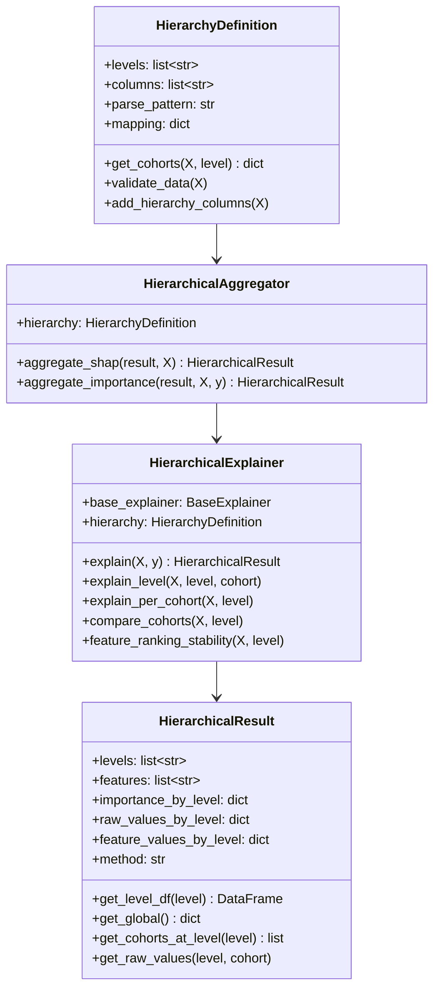
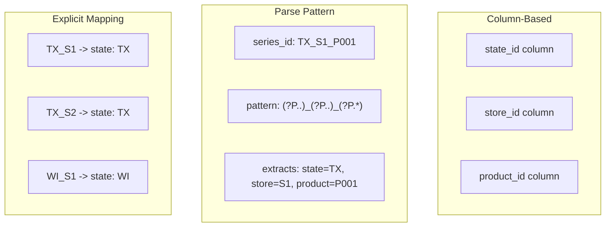
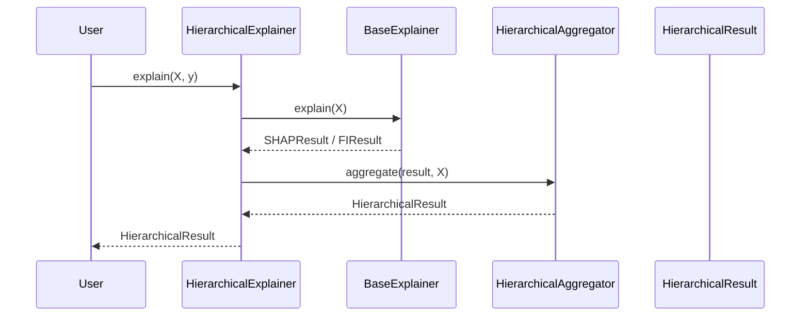

# Implementation Plan: Hierarchical explainer (`xeries.hierarchy`)

**Branch**: `feat/spec-006-plan-tasks` | **Date**: 2026-05-14 | **Spec**: [spec.md](./spec.md)
**Home repo**: xeries
**Input**: Feature specification from `/specs/006-hierarchical-explainer/spec.md`

> **Status: Backfilled from implementation** — this plan describes the code as
> it exists on `feat/sdd-adoption` (and therefore on `feat/spec-006-plan-tasks`)
> at the commit that introduced the `xeries.hierarchy` subpackage (`2a5d7f6`)
> plus the test refactor at `65369dc`. No source files under `src/xeries/` or
> `tests/` are modified in this round; only `plan.md` and `tasks.md` are added.
> Redesigns of the public surface require a follow-up spec.

## Summary

`xeries.hierarchy` lifts any `BaseExplainer` (today: `ConditionalSHAP`,
`ConditionalPermutationImportance`) into a hierarchical explainer that
aggregates feature importance across an arbitrary tree of cohorts —
country → state → store → product for M5-style demand forecasting, or any
similar multi-series structure. The implementation lives in four modules
(`types.py`, `definition.py`, `aggregator.py`, `explainer.py`) and is
re-exported both from `xeries.hierarchy` and from the top-level `xeries`
namespace.

This plan is a **backfill**: the code, the tests, and the architecture
documentation were all written *before* SDD adoption. The work this round is
to document the existing implementation in the SDD shape (plan.md +
tasks.md) so the `specs/006-hierarchical-explainer/` triplet is complete and
the roadmap row at status `Backfilled` is fully traceable.

## Technical Context

**Language/Version**: Python ≥3.10 (per `xeries/pyproject.toml`).
**Primary Dependencies**: `numpy`, `pandas`, `scikit-learn`, `shap>=0.49.1` —
all already-required runtime deps in `pyproject.toml`. `skforecast>=0.21.0`
remains an optional extra, used by the hierarchical explainer transitively
only when the wrapped base explainer is built on a skforecast forecaster.
**Storage**: N/A — pure in-process computation; results are pandas DataFrames
and dictionaries inside the `HierarchicalResult` container.
**Testing**: `pytest`; 4 contract-test files in `tests/hierarchy/`
(`test_definition.py`, `test_aggregator.py`, `test_explainer.py`,
`test_types.py`) covering every public symbol named in the spec's "Public
API" section.
**Target Platform**: Library; Linux / macOS / Windows; CPU-only.
**Project Type**: Single-project library (`src/xeries/` layout).
**Performance Goals**: Aggregation is O(n_samples × n_features × n_levels)
and re-runs the base explainer per cohort only on the `aggregate_importance`
path; no specific latency budget is set by the spec.
**Constraints**: Must work with both `AttributionExplainer` subclasses
(per-row attributions, e.g. SHAP) and `MetricBasedExplainer` subclasses
(per-cohort metric drops, e.g. permutation importance) — explicit in FR-006.3.
**Scale/Scope**: Designed for M5-class hierarchies (≤ 4 levels, ≤ ~30k
leaves); no formal upper bound but `aggregate_importance` cost grows
linearly with the number of cohorts at the deepest level.

## Constitution Check

*GATE: Must pass before Phase 0 research. Re-check after Phase 1 design.*

Reference: `.specify/memory/constitution.md` v1.0.0. This is a **backfilled**
plan: the code already exists on `main`, so the gate questions are answered
against the historical implementation, with any test-first inversions
captured in the Complexity Tracking table below.

| Principle | Gate question | Verdict (Pass / Needs justification / N/A) | Notes |
| --- | --- | --- | --- |
| I. Specs before code | Does this feature have a `spec.md` authored before any implementation commit? For Backfilled items, is the "Backfilled from implementation" banner present? | Pass (Backfilled) | `specs/006-hierarchical-explainer/spec.md` exists on `feat/sdd-adoption` (authored as part of `0e88ef6 docs(sdd): add AGENTS.md and backfill specs 001-007`) and carries the `Status: Backfilled from implementation` banner pinning commit `858a498`. |
| II. Agent-agnosticism | Does this plan avoid introducing agent-specific constructs (Copilot-only / Cursor-only prompts) in `src/`, `tests/`, or `docs/`? Shim-only additions are fine and live in per-agent directories of the consumer repo. | Pass | The `xeries.hierarchy` subpackage and its tests contain no agent-specific code, prompt strings, or shim references. Only generic library code. |
| III. Test-first for new contracts | Is there at least one failing contract test planned (or present, for backfills) for every new public symbol? | Needs justification (Backfilled) | The tests in `tests/hierarchy/` were authored in the same commit as the implementation (`2a5d7f6 Add unit tests for hierarchy components and visualization functions`), not before it. Every public symbol named in the spec's "Public API" section — `HierarchyDefinition`, `HierarchicalAggregator`, `HierarchicalExplainer`, `HierarchicalResult` — has a dedicated `TestXxx` class with input-validation, output-shape, and smoke-correctness assertions (956 LoC of tests against 990 LoC of implementation). Test-first inversion captured in Complexity Tracking row below. |
| IV. Typed public surface | Are all new public symbols typed? Will `ty check src` and `ruff` pass? | Pass | All four public modules use `from __future__ import annotations` and carry complete signatures on every public name. CI is expected to remain green; verified locally with `uv run ty check src` and `uv run ruff check src tests` (see Quality Gates section in the parent plan). |
| V. Reproducibility discipline (bench only) | If Home repo is `xeries-bench`: is there a single `uv run` entrypoint, explicit seeding, a pinned `xeries` dependency, and a <60s CI smoke test? | N/A | Home repo is `xeries`, not `xeries-bench`. |
| Repo scope | Does this plan respect the Repo-scope table in the constitution? Specifically: are `lightgbm`, `shapiq`, notebook-heavy artefacts kept out of `xeries` runtime deps and confined to `xeries-bench` (or to `xeries`'s optional extras)? | Pass | `xeries.hierarchy` uses only `numpy` / `pandas` / `scikit-learn` / `shap` — all already-required runtime deps. No `lightgbm`, no `shapiq`, no `causal-learn`. No notebooks live in this subpackage. |

Any verdict of "Needs justification" is recorded in the Complexity Tracking
table below with a Simpler Alternative explanation.

## Architecture

Lifted from [`docs/architecture/hierarchy.md`](../../docs/architecture/hierarchy.md)
(312 LoC, already on the branch). Reproduced here for SDD self-containment;
that document remains the canonical detailed reference.

### Class structure



### Hierarchy-definition strategies



### Aggregation rules

For SHAP-style attributions (FR-006.2):

$$\phi_i(C_k) = \frac{1}{|C_k|} \sum_{x \in C_k} |\phi_i(x)|$$

where $\phi_i(C_k)$ is the mean absolute SHAP for feature $i$ in cohort
$C_k$ and $|C_k|$ is the number of samples in the cohort.

For permutation-style importances, importance is re-computed per cohort by
running the base explainer on each cohort's rows; this is the
`HierarchicalAggregator.aggregate_importance(...)` path.

### Explain workflow



## Project Structure

### Documentation (this feature)

```text
specs/006-hierarchical-explainer/
├── spec.md          # business-facing specification (Backfilled)
├── plan.md          # this file
└── tasks.md         # implementation task list (backfill mapping)
```

No `research.md`, `data-model.md`, `quickstart.md`, or `contracts/` directory
is required for a backfill — the architecture document at
`docs/architecture/hierarchy.md` already plays the role of design notes, and
the contract tests in `tests/hierarchy/` already encode the public-API
contract.

### Source Code (repository root)

```text
src/xeries/
├── __init__.py                 # re-exports HierarchicalExplainer, ... (lines 60-64, 94-98)
└── hierarchy/
    ├── __init__.py             # 40 LoC — package docstring + 4 re-exports
    ├── types.py                # 148 LoC — HierarchicalResult dataclass + accessors
    ├── definition.py           # 307 LoC — HierarchyDefinition (columns / parse / mapping strategies)
    ├── aggregator.py           # 254 LoC — HierarchicalAggregator (aggregate_shap, aggregate_importance)
    └── explainer.py            # 281 LoC — HierarchicalExplainer (orchestrator + compare/stability helpers)

tests/
└── hierarchy/
    ├── __init__.py
    ├── test_types.py           # 176 LoC — TestHierarchicalResult, TestHierarchicalResultEdgeCases
    ├── test_definition.py      # 265 LoC — TestHierarchyDefinitionInit / ColumnBased / ParseBased / ExplicitMapping / Repr
    ├── test_aggregator.py      # 256 LoC — TestHierarchicalAggregatorSHAP / Importance / PerSeries
    └── test_explainer.py       # 259 LoC — TestHierarchicalExplainer{Init, Explain, ExplainLevel, Compare, Repr}

docs/
└── architecture/
    └── hierarchy.md            # 312 LoC — canonical architecture reference
```

**Structure Decision**: Single-project (`src/xeries/` layout, library style),
matching the rest of the repository. `xeries.visualization.hierarchy_plots`
(524 LoC) and `tests/visualization/test_hierarchy_plots.py` (263 LoC) are
**out of scope for this spec** — they live in `xeries.visualization` and
are owned by `specs/007-visualization`. Only the `xeries.hierarchy`
subpackage is in scope here.

## Files this PR adds / changes

- `specs/006-hierarchical-explainer/plan.md` — this file (new).
- `specs/006-hierarchical-explainer/tasks.md` — sibling file (new).
- `specs/006-hierarchical-explainer/spec.md` — appended single "See also"
  line linking to plan.md and tasks.md (no content rewrite).

No file under `src/xeries/`, `tests/`, `docs/`, `.specify/`, or any other
directory is modified. The PR is markdown-only.

## Quality gates

All gates run against this PR's branch; they are expected to pass because
no runtime code changes:

- `uv run ruff check src tests` — formatter / linter.
- `uv run ty check src` — type checker.
- `uv run pytest` — full test suite (all `tests/hierarchy/*` plus the
  rest of the repo).
- `uv run pre-commit run --all-files` — pre-commit hooks per
  `.pre-commit-config.yaml` (25 LoC).
- CI: `.github/workflows/ci.yml` (136 LoC) re-runs the three commands above
  on PR.

## Complexity Tracking

> Filled because Constitution Check has one "Needs justification" verdict.

| Violation | Why Needed | Simpler Alternative Rejected Because |
|-----------|------------|-------------------------------------|
| Principle III (test-first) inverted: implementation and contract tests landed in the same commit (`2a5d7f6`), with tests authored after / alongside implementation rather than before. | The `xeries.hierarchy` subpackage predates SDD adoption (governance v1.0.0 was ratified after the implementation was already on `main`). Backfilling test-first ordering would require rewriting git history. | Re-writing history would invalidate every existing reference to commits on `hierarchical_aggregations` and break the `Backfilled` lineage. The constitution explicitly permits this inversion for Backfilled items (Principle I, second paragraph) provided the spec carries the banner — which it does. Future hierarchy-related work (e.g. `HierarchicalCausalExplainer`, listed as Out-of-Scope in spec.md) will follow standard test-first ordering on a fresh spec. |

## Out of scope

- **Modifying `src/xeries/hierarchy/*.py` or `tests/hierarchy/*.py`** — lift
  as-is; redesigns require a follow-up spec.
- **`src/xeries/visualization/hierarchy_plots.py` and `tests/visualization/test_hierarchy_plots.py`** —
  owned by `specs/007-visualization`, not 006.
- **Authoring `plan.md` / `tasks.md` for specs 001-005 and 007** — they also
  lack the full triplet but are out of scope for this hierarchy-focused PR.
- **Reconciliation of forecasts across the hierarchy (`MinT`/`OLS` family)** —
  carried over from spec.md "Out of scope".
- **`HierarchicalCausalExplainer`** — blocked by the absence of a
  `CausalFeatureImportance` base explainer; tracked separately in the
  roadmap.

## Acceptance criteria

- `specs/006-hierarchical-explainer/plan.md` exists, follows the template
  shape, carries the `Backfilled from implementation` banner, and has a
  complete Constitution Check table with every row answered.
- The Complexity Tracking table records the Principle III inversion with a
  Simpler Alternative explanation.
- `specs/006-hierarchical-explainer/tasks.md` exists (sibling file,
  authored next).
- `specs/006-hierarchical-explainer/spec.md` is unchanged except for an
  appended "See also: [plan.md](./plan.md) · [tasks.md](./tasks.md)" line.
- `uv run ruff check src tests`, `uv run ty check src`, `uv run pytest` are
  all green on the new branch.
- No file outside `specs/006-hierarchical-explainer/` is modified.
